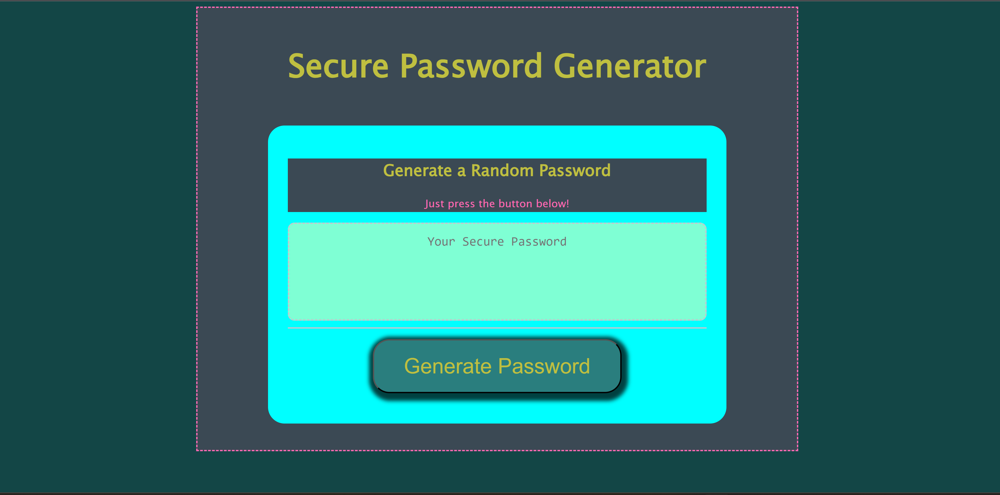
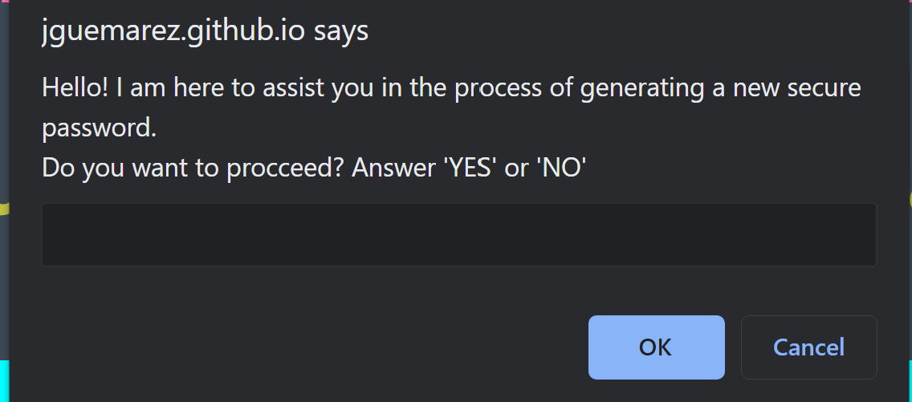
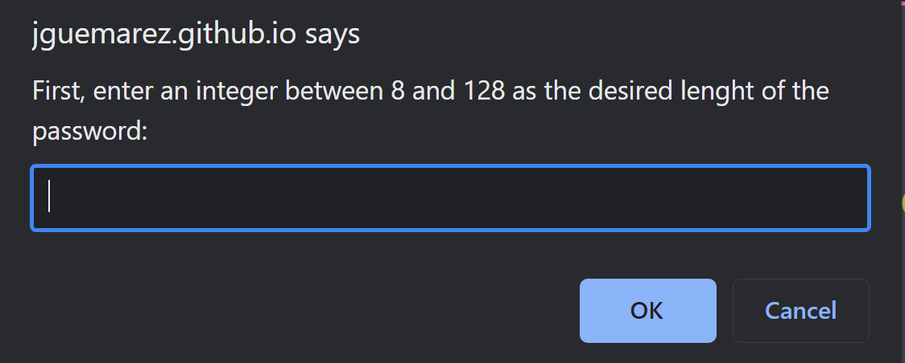
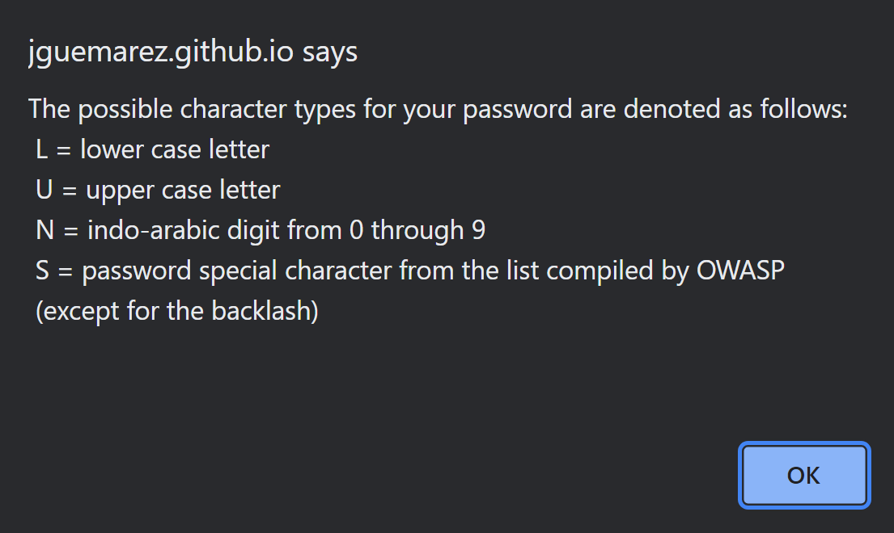
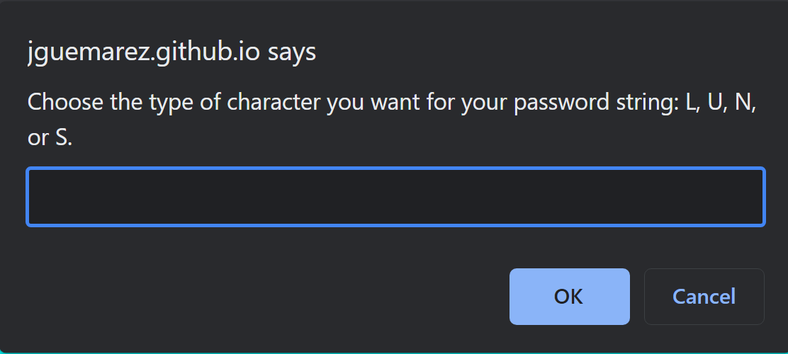

# Random Password Generator
## Description
The problem of third-parties accessing personal, medical, and financial information without authorization is one of the most pressing in the contemporary world, driven as it is by electronic exchanges of communications. To avoid this, most people have to fill login forms that require the use of passwords on a daily basis. The requirements for said passwords vary both in terms of specified length and the type of characters that are allowed as part of the submitted string. In addition, some commonly given tokens of cybersecurity advice are :

        1. Not to use the same exact password for different accounts.
        2. Not to use passwords that could be easily be guessed and memorized by third parties.
        3.To change passwords frequently even for the same account.

For employees with access to sensitive data, the number of different accounts, databases, or apps with restricted access that they have to login using a password can be very high. Coming up with so much passwords satisfying certain security criteria can be a daunting task. As a way to help a hypothetical person in that situation, we decided to design and script this Web app that, through a simple and intuitive UI, guides the user through the generation of a random secure password of a given length that might or might not contain certain type of characters.

## Usage

The finished and (hopefully thoroughly debugged) application is available at:

https://jguemarez.github.io/RandomPasswordGen/

The page resembles this image:

 (when viewed in the 114.0.5735.201 (Official Build) (64-bit) (cohort: M115_Early_Stable_control)  Google Chrome browser.)

 Once you press the "Generate Button" on the lower part of the page, a series of prompts and alerts will guide you through the generation of anew password.
 
 1. Firtst, you decide whether you actually want to follow the instructions:

 

 2. Choosing the length (in terms of the number of characters in the string) of the password to be generated:

 

 3. Specifying the types of characters that are available and the inputs required to choose them:

 

4. Then the user will be asked to input which character type the choose as many times as the password is long:

5.Finally, the user will be shown the generated password in the screen:

## Authoring
The author of this app is Jonathan Maldonado Guemarez. The repository containing the HTML, CSS, and JS source code can be found at:

https://github.com/jguemarez/RandomPasswordGen

The starting code that served as inspiration and guidance to this project is of the authorship of Xandromus and can be found here:

https://github.com/coding-boot-camp/friendly-parakeet 

## Help

To ask any question regarding this Web app or its source code, feel free to write to me:
cantor.dedekind112358@gmail.com

## Contributing

The repository is public, so downloads and pull requests are welcome. However, if you want to suggest a change or if you found a bug, please open an issue for evaluation before pushing any changes.

## License

This is an open source project under the MIT license. Please check the LICENSE file at GitHub repository for further information.
